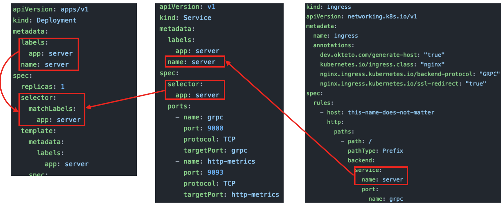

> 코딩냄비 프로젝트 중 `pr12er`는 TensorFlow Korea의 논문을 읽고/리뷰하는 모임 PR12에서 촬영된 동영상을 큐레이션하는 프로젝트입니다. 개략적으로 프론트엔드는 `Flutter`, 백엔드는 `GO`로 작성되었으며, 이 둘간의 인터페이스는 `gRPC/protobuf`로 구성되어있습니다. 특히 `pr12er` 프로젝트의 백엔드 서버는 `PR`이 `Merge` 됨과 동시에 `Okteto`가 제공하는`k8s` 에 배포되는 `CD` 루틴을 탑니다.

이 글은 `Okteto` 에 배포하기위한 파이프라인을 분석하는 총 X 편의 시리즈물 중 두 번째입니다.

1. [`Okteto` 파이프라인 개요, `okteto build`, `pr12er` 서버용 `Dockerfile` 분석](https://codingpot.github.io/cicd/okteto-pipeline-build/)
2. [Okteto에 gRPC용 Deployment, Service, Ingress 설정]()
3. ................

# `pr12er`에 적용된 `Okteto` 파이프라인 명세서

```yaml
deploy:
#  - okteto build -t okteto.dev/codingpot-pr12er-server:${OKTETO_GIT_COMMIT} -f ./server/deploy/Dockerfile server
  - for file in k8s/kkweon-okteto/*.yaml; do envsubst < $file | kubectl apply -f -; done
#  - kubectl set image deployment server server=okteto.dev/codingpot-pr12er-server:${OKTETO_GIT_COMMIT}
#  - kubectl rollout restart deployment grafana-agent
#  - kubectl rollout status deployment server && kubectl rollout status deployment grafana-agent
```

## 어떤 `yaml` 파일들이 존재하나?

```shell
k8s/kkweon-okteto/
├── ingress.yaml
└── server.yaml
```

현재 `/k8s/kkweon-okteto/` 디렉터리 내부에는 보다 다양한 `yaml` 파일들이 존재하지만, `gRPC` 서버를 운용하기위한 최소한의 조건은 k8s의 `Deployment`, `Service`, `Ingress` 객체를 정의해둔 `ingress.yaml` 및 `server.yaml` 두 파일만 참조하면 된다. 우선 각 파일의 세부 사항과 서로 엮인 관계를 분석해보자.



### `Ingress`
- 서버 애플리케이션이 위치한 쿠버네티스 플랫폼은 외부로부터 차단된 고유한 영역을 가진다. 하지만 사용자는 쿠버네티스 플랫폼 외부에  존재하는것이 보통이며, 이들은 쿠버네티스 자원으로 구축된 서버에 접근할 필요가 있다. `Ingress`는 쿠버네티스 외부와 내부를 엮어주는 일종의 브릿지 역할을 하는 객체이다. 

#### `Ingress` Annotations
[**dev.okteto.com/generate-host: "true"**](dev.okteto.com/generate-host)
- `Okteto` 에서 자동으로 호스트 이름을 할당하는것을 허용하고자 할 때 사용되는 애노테이션입니다. `Okteto` 서비스를 활용한다면 거의 반드시 설정해줘야 하므로, `true`로 설정하였습니다.

[**kubernetes.io/ingress.class: "nginx"**](https://www.nginx.com/resources/glossary/kubernetes-ingress-controller/)
- 쿠버네티스의 Ingress 컨트롤러를 nginx로 지정한다는 의미입니다.
- Ingress 컨트롤러의 역할에는 외부 트래픽을 수용하여 내부 Pod 들로 로드밸런싱하기, 클러스터 밖의 다른 서비스와 소통이 필요한 트래픽 관리, Pods들을 모니터링하여 추가/제거에 따른 로드밸런싱 규칙 갱신 등이 있습니다. 
- 쿠버네티스가 공식적으로 지원하는 Ingress 컨트롤러로는 `AWS`, `GCE`, `nginx`가 있으며, 그 외의 써드파티에서 나온 Ingress 컨트롤러도 종류가 다양하니 요구사항에 맞는것을 찾아서 사용하면 됩니다 [(목록)](https://kubernetes.io/docs/concepts/services-networking/ingress-controllers/).

[**nginx.ingress.kubernetes.io/backend-protocol: "GRPC"****](https://kubernetes.github.io/ingress-nginx/examples/grpc/#grpc)
> This is the magic ingredient that sets up the appropriate nginx configuration to route http/2 traffic to our service.
- 위는 공식문서의 설명입니다. 즉 nginx의 설정을 건드려서, `HTTP/2` 트래픽이 쿠버네티스 내부 서비스로 들어올 수 있도록 해줍니다. gRPC를 사용하려면 `HTTP/2` 프로토콜이 반드시 필요하므로, 이 설정을 반드시 해줘야 합니다.

[**nginx.ingress.kubernetes.io/ssl-redirect: "true"**](https://kubernetes.github.io/ingress-nginx/examples/rewrite/)
> Indicates if the location section is accessible SSL only (defaults to True when Ingress contains a Certificate)
- 위는 공식문서의 설명입니다. SSL로만 접근 가능함을 명시합니다(디폴트는 `true` 인데, 여기서는 명시적으로 `true` 라고 적어줌). gRPC를 사용하려면 SSL이 반드시 필요하므로, 이 설정 또한 반드시 해줘야 합니다.

#### `Ingress` Spec

`Ingress` 스펙은 일련의 규칙을 정의합니다. 특히 `backend` 라는 필드와, 그 이전까지의 부분들로 나누어 생각할 수 있습니다. `backend`는 말 그대로 `Ingress`를 통해 도달한 트래픽이 도달해야 할 쿠버네티스 내부의 위치를 의미합니다. 따라서 `backend`는 쿠버네티스 내부에서 목적지를 찾아가기 위한 규칙을 정의하는 필드이며, `backend` 이전까지의 필드들은 수용할 외부 트래픽의 형식을 판단하는 규칙을 정의합니다. 

```yaml
d
```

### Service Metadata

### Service Spec

### Deployment Metadata

### Deployment Spec

```shell
> kubectl create deployment server --dry-run=client -o yaml
# https://kubernetes.io/docs/reference/generated/kubectl/kubectl-commands#create
```

# 참고자료
- How Deployment, Service, Ingress are related in their manifest
  - https://dwdraju.medium.com/how-deployment-service-ingress-are-related-in-their-manifest-a2e553cf0ffb
- dev.okteto.com/generate-host